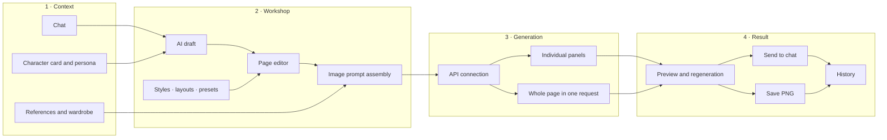

# 🔨 BB Comic Forge

[Русский](README.md) · **English** · [Changelog](CHANGELOG.md#english)

A standalone comic workshop for **SillyTavern**. Turn a scene you have already played into an editable comic-page draft, generate individual panels or an entire page, and send the finished comic back to the chat.

Comic Forge does not replace roleplay or make creative decisions without your involvement. AI prepares a draft from context; you can review and edit the scene, characters, composition, dialogue, style, and final prompt.

This README is available in English; translating the extension interface is a separate task.

---

## ✨ Features

| Area | Capabilities |
| --- | --- |
| 📝 **Drafting** | AI drafts from the chat, character card, and user persona; edit the scene, character lock, panels, dialogue, SFX, and insets |
| 🎨 **Generation** | Generate panels separately or a whole page as one image; up to 6 panels and 6 concurrent requests |
| 🧩 **Presets** | Styles, layouts, draft sets, and portable `*.bbcf-preset.json` files; a library with search, filters, import, and export |
| 🖼️ **Visual references** | Character, NPC, and user references; a shared wardrobe library with outfits selected separately for each chat |
| 🔎 **Review** | Inspect the final image prompt, regenerate a panel, enlarge a page, export PNG, and send to chat |
| 📚 **History** | Up to 24 explicitly saved comics in total; the workshop shows entries for the current character/chat context |
| 📱 **Mobile layout** | A centered full-screen workshop, separate editor/result tabs, and a single-column preset library |
| ⚡ **Automation** | Optional sequence after a character reply: AI draft → generation → send the finished comic to chat |

## 🧭 Workflow



Page preparation and image generation are separate steps. You can stop after drafting, edit any field, and then send the assembled prompt to your chosen provider.

## 📦 Installation

1. Open SillyTavern.
2. Go to **Extensions → Install extension**.
3. Enter this repository URL:

   ```text
   https://github.com/maxkara14/BB-Comic-Forge
   ```

4. Reload SillyTavern.
5. Open **Extensions → BB Comic Forge** and configure your connections.

Neither sillyimages nor SLAYimages is required.

## 🚀 Quick start

1. Under image generation settings, choose an API type, endpoint, key, and model.
2. Optionally save the connection as a profile.
3. Configure the AI draft source: the current SillyTavern model, a SillyTavern connection profile, or a separate OpenAI/Gemini-compatible endpoint.
4. Click **Open workshop** (`Открыть кузницу`).
5. Select **Draft from chat** (`Черновик из чата`) or fill in the page manually.
6. Review the scene, characters, generation mode, layout, style, panels, dialogue, insets, and SFX.
7. Click **Generate page** (`Сгенерировать страницу`).
8. Send the result to chat or save it as PNG.

On phones, the editor and result have separate tabs so the long form does not compete with the preview for screen space.

## 🔌 Connections

### Image generation

Supported connection types:

- Gemini / Nano Banana-compatible endpoints;
- OpenAI-compatible Chat Completions with image output;
- OpenAI Images through `images/generations` and `images/edits`;
- Naistera.

Save multiple profiles to switch between providers, endpoints, keys, models, and related settings. Connecting loads model suggestions from the provider when available; built-in names serve as fallback suggestions, and you can always enter a model manually. Naistera uses a built-in list. A model listing does not guarantee image-generation support.

OpenAI Images uses `images/generations` without references and `images/edits` when reference images are attached. If a compatible service explicitly reports that the edit endpoint or image input is unsupported, **Comic Forge retries without files**, retaining textual descriptions of references and clothing in the prompt.

The browser console records the endpoint used and the number of attached files, without logging the API key or prompt contents.

### AI drafting

The draft can be written by:

- the current SillyTavern model;
- a selected SillyTavern connection profile;
- a separate OpenAI-compatible chat endpoint;
- a separate Gemini-compatible endpoint.

Draft connection profiles are shared across chats. Selecting one restores its connection mode, endpoint, key, model, temperature, and selected SillyTavern profile. Editing fields does not overwrite the saved profile until you explicitly update it.

### Saving image and draft connection profiles

Both sections use the same actions:

- **Update selected** (`Обновить выбранный`): overwrite the selected profile with the current settings.
- **Save as new…** (`Сохранить как новый…`): enter a name and create a separate profile, keeping the original.
- **Delete profile…** (`Удалить профиль…`): confirm deletion of the selected saved entry. The current connection settings remain in place.

Update and delete are disabled when no saved profile is selected. Cancelling the name or deletion dialog leaves the saved profiles unchanged.

## 📝 Pages, drafts, and automation

**Default page** provides the starting settings for new drafts and automatic generation: mode, sending to chat, panel count, layout, style, character lock, panel plan, dialogue, insets, SFX, and additional prompts.

Changes within a chat override only the fields you edit. For example, you can change the layout for the current scene while leaving the other fields linked to the defaults.

Draft sets support recurring scenarios such as action, quiet dialogue, vertical webtoons, or detailed anime drafts. They do not store the current scene and can be used across chats.

**Automatically after a bot reply** runs the full sequence only after a normal character reply preceded by a user message. First messages, system entries, and the extension's own comics do not retrigger automation.

### Portable presets

Export creates a versioned `*.bbcf-preset.json` file containing:

- generation mode, sending behavior, and panel count;
- the selected style's full prompt;
- the full layout, including pacing and aspect ratios;
- the AI drafting prompt;
- additional instructions and a negative prompt;
- optional recommendations for API type, model, size, and quality.

Portable files exclude API keys, endpoints, connection profiles, the current scene, characters, panels, dialogue, insets, SFX, references, and wardrobe items. Before import, Comic Forge previews the contents and offers to add the preset to the library or add and apply it immediately.

The library supports search, filters, preview, application, updating from current settings, renaming, duplication, export, and deletion. On desktop, choose 2, 4, or 6 library columns. On phones, the library temporarily uses one column without changing the saved preference.

After applying a draft preset, the selected style and layout names are refreshed in the editor and settings summary. Deleting a draft preset can also remove its linked saved style and layout when no other draft preset uses them; shared entries remain in the library if you keep them.

## 🧠 Image prompt assembly

**Image prompt** shows the text Comic Forge prepares for the model. Images do not appear there as base64; supported image files are attached to the request separately.

In per-panel mode, copy one panel's prompt or all prompts. Whole-page mode provides a single page prompt.

**Chat message context** is used only by AI drafting by default. Enable **Add message context to the image prompt** to include it directly in image generation.

In economical mode, shared page information, character lock, references, wardrobe, and context are included once instead of being repeated for every panel.

## 🖼️ References and wardrobe

Regular character, NPC, and user references belong to the current context. Upload them or paste them from the clipboard, and optionally add names and text descriptions for providers without image input.

The wardrobe library is shared, while equipped items are saved separately for each character/chat context. Describe, tag, and edit items, then apply a complete outfit or select items by category.

Comic Forge does not independently truncate the active reference list. It sends all successfully loaded, enabled images; the model and provider determine the actual limit.

Files are stored in SillyTavern under `/user/images/bbcf_refs`. **Restore** can recover wardrobe images into the library when the files still exist but their library entries have been lost.

## 🔎 Preview, export, and history

Enlarge results, send them to chat, save them as PNG, or regenerate individual panels. Comics in chat messages also have an enlargement button, particularly useful on phones.

History does not save every experimental generation. An entry is created only when you explicitly:

- send the comic to chat; or
- save the page as PNG.

History holds up to 24 entries across all contexts and displays only the current context's comics. Open a page, send it to chat, delete an entry, or clear the list from history.

## 🔒 Storage and privacy

- Settings, profiles, presets, and API keys are stored in SillyTavern extension settings. Do not share settings exports or browser profiles containing your keys.
- Portable `*.bbcf-preset.json` files do not contain API keys, endpoints, or connection profiles.
- Image-request diagnostics do not log keys or full prompts.
- Deleting files from `user/images/bbcf_refs` breaks their associated previews. Recovery requires the original file or a backup.

## ⚠️ Limits

- Up to 6 panels per page.
- Up to 6 concurrent generations.
- Up to 3 previous chat images in visual context.
- Up to 24 saved comics across all contexts.
- Regular and wardrobe reference limits depend on the provider and model.
- PNG export depends on the browser and image availability in the preview.
- Clipboard paste depends on browser support and page permissions.
- Most image APIs do not report a real completion percentage; the progress indicator shows the current stage and elapsed time.

## 🛠️ Console API

```js
BBComicForge.open()
BBComicForge.settings()
BBComicForge.generateFromDraft(draft)
```

## 👤 Author and credits

- **BB Comic Forge:** BruniikBron / BB extensions.
- 🌐 [BruniikBron: Lo-Fi & Mods](https://bblofi.online/)
- 💬 [Telegram](https://t.me/Brun11kBr0n)
- Image-generation and reference workflows were inspired by [sillyimages](https://github.com/0xl0cal/sillyimages) by 0xl0cal.
- The wardrobe, NPC slots, and some UX ideas were inspired by [SLAYimages](https://github.com/wewwaistyping/SLAYimages) by Wewwa; the ecosystem also credits contributions from hydall, aceeenvw, and other authors.

Comic Forge is not a fork of sillyimages or SLAYimages and does not require either extension.
