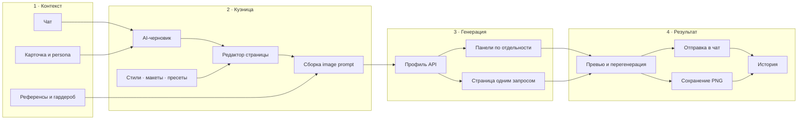

# 🔨 BB Comic Forge

Самостоятельная кузница комиксов для **SillyTavern**. Она превращает уже сыгранную сцену в управляемый comic-page draft, генерирует отдельные панели или цельную страницу и возвращает готовый комикс в чат.

Comic Forge не заменяет ролеплей и не принимает творческие решения без вашего участия: AI собирает черновик из контекста, а сцену, персонажей, композицию, реплики, стиль и итоговый prompt можно проверить и изменить вручную.

---

## ✨ Что умеет

| Блок | Возможности |
|---|---|
| 📝 **Черновик** | AI-черновик из чата, карточки персонажа и persona пользователя; ручная правка сцены, character lock, панелей, реплик, SFX и вставок |
| 🎨 **Генерация** | Отдельный запрос для каждой панели или вся страница одной картинкой; до 6 панелей и 6 параллельных генераций |
| 🧩 **Пресеты** | Стили, макеты, наборы черновика и переносимые `*.bbcf-preset.json`; библиотека с поиском, фильтрами, импортом и экспортом |
| 🖼️ **Визуальная память** | Референсы персонажа, NPC и пользователя; гардероб с общей библиотекой вещей и отдельными образами для каждого чата |
| 🔎 **Контроль результата** | Просмотр итогового image prompt, повторная генерация панели, увеличение страницы, PNG-экспорт и отправка в чат |
| 📚 **История** | До 24 явно сохранённых комиксов суммарно; в кузнице показываются записи текущего контекста персонажа/чата |
| 📱 **Мобильный режим** | Центрированная полноэкранная кузница, отдельные вкладки редактора и результата, одноколоночная библиотека пресетов |
| ⚡ **Автоматизация** | Опциональная цепочка после ответа бота: AI-черновик → генерация → автоматическая отправка готового комикса в чат |

---

## 🧭 Как устроена кузница



Кузница разделяет подготовку страницы и генерацию изображения. Можно остановиться после AI-черновика, переписать любое поле и только затем отправить собранный prompt выбранному провайдеру.

---

## 📦 Установка

1. Откройте SillyTavern.
2. Перейдите в `Расширения → Установить расширение`.
3. Вставьте адрес репозитория:

   ```text
   https://github.com/maxkara14/BB-Comic-Forge
   ```

4. Перезагрузите страницу SillyTavern.
5. Откройте `Расширения → BB Comic Forge` и настройте подключения.

Расширение не требует установки sillyimages или SLAYimages.

## 🚀 Быстрый старт

1. В блоке `API генерации картинок` выберите провайдера, endpoint, API key и модель.
2. При необходимости сохраните подключение как профиль.
3. Настройте источник для `AI-черновика`: текущую модель SillyTavern, профиль SillyTavern либо отдельный OpenAI/Gemini-compatible endpoint.
4. Нажмите `Открыть кузницу`.
5. Выберите `Черновик из чата` или заполните страницу вручную.
6. Проверьте сцену, персонажей, режим, макет, стиль, панели, реплики, вставки и SFX.
7. Нажмите `Сгенерировать страницу`.
8. Отправьте результат в чат или сохраните PNG.

На телефоне редактор и результат находятся на отдельных вкладках, поэтому длинная форма не конкурирует с превью за место на экране.

---

## 🔌 Подключения

### Генерация изображений

Поддерживаются:

- **Gemini / Nano Banana compatible** endpoint;
- **OpenAI-compatible Chat Completions** с генерацией изображений;
- **OpenAI Images** через `images/generations` и `images/edits`;
- **Naistera**.

Можно сохранять несколько профилей подключения и переключаться между провайдерами, endpoint, ключами, моделями и связанными параметрами. После подключения список моделей заполняется ответом провайдера. Встроенные названия используются только как запасные подсказки, а модель всегда можно ввести вручную.

В режиме OpenAI Images запрос без картинок идёт через `images/generations`, а запрос с референсами — через `images/edits`. Если совместимый источник явно сообщает, что edit endpoint или image input не поддерживается, Comic Forge повторяет запрос без файлов, сохраняя текстовые описания референсов и одежды в prompt.

Использованный endpoint и число прикреплённых файлов выводятся в консоль браузера без API-ключа и содержимого prompt.

### AI-черновик

Черновик может писать:

- текущая модель SillyTavern;
- выбранный профиль подключения SillyTavern;
- отдельный OpenAI-compatible chat endpoint;
- отдельный Gemini-compatible endpoint.

Профили AI-черновика общие для всех чатов. Выбор профиля применяет режим, endpoint, ключ, модель и температуру. Ручное изменение полей не перезаписывает профиль — для этого нужно нажать `Сохранить`.

---

## 📝 Страница, черновики и автоматизация

`Страница по умолчанию` задаёт основу новых черновиков и автоматической генерации: режим, отправку в чат, число панелей, макет, стиль, character lock, план панелей, реплики, вставки, SFX и дополнительные prompts.

Изменения внутри конкретного чата становятся локальными только для изменённых полей. Например, можно выбрать другой макет для текущей сцены, не отвязывая остальные параметры от настроек по умолчанию.

Наборы черновика подходят для повторяемых сценариев — динамичного экшена, спокойного диалога, вертикального webtoon или подробного anime draft. Они не хранят текущую сцену и могут применяться в разных чатах.

Опция `Автоматически после ответа бота` запускает полную цепочку только после обычного ответа персонажа и только если перед ним было сообщение пользователя. Первое сообщение, системные записи и комиксы самого расширения не запускают автоматизацию повторно.

### Переносимые пресеты

Экспорт создаёт версионированный файл `*.bbcf-preset.json`, содержащий:

- режим генерации, отправку и число панелей;
- полный prompt выбранного стиля;
- полный макет с ритмом и соотношениями сторон;
- prompt AI-черновика;
- дополнительные инструкции и negative prompt;
- необязательные рекомендации по типу API, модели, размеру и качеству.

API key, endpoint, профили подключений, текущая сцена, персонажи, панели, реплики, вставки, SFX, референсы и гардероб в переносимый файл не входят. Перед импортом Comic Forge показывает состав файла и предлагает либо добавить пресет в библиотеку, либо сразу добавить и применить его.

В библиотеке доступны поиск, фильтры, просмотр, применение, обновление текущими настройками, переименование, дублирование, экспорт и удаление. На компьютере можно выбрать 2, 4 или 6 колонок; на телефоне библиотека временно отображается в одну колонку, не меняя сохранённую настройку.

---

## 🧠 Как собирается image prompt

Блок `Prompt изображения` показывает именно тот текст, который Comic Forge подготовил для модели. Картинки не вставляются туда как base64: поддерживаемые провайдером файлы прикладываются к запросу отдельно.

В режиме отдельных панелей можно копировать prompt одной панели или все prompts сразу. В режиме цельной страницы доступен общий prompt страницы.

`Контекст сообщений из чата` по умолчанию используется только AI-черновиком. Чтобы добавить его непосредственно в image prompt, включите отдельный переключатель `Добавлять контекст сообщений в prompt изображения`.

В экономном режиме общие блоки страницы, character lock, референсы, гардероб и контекст добавляются один раз, а не повторяются для каждой панели.

## 🖼️ Референсы и гардероб

Обычные референсы персонажа, NPC и пользователя относятся к текущему контексту. Их можно загрузить файлом или вставить из буфера обмена, а также снабдить именем и текстовым описанием для провайдеров без image input.

Библиотека гардероба общая, но надетые вещи сохраняются отдельно для каждого контекста персонажа/чата. Вещи можно описывать, тегировать, редактировать и назначать целым образом или по категориям.

Comic Forge не обрезает список активных референсов самостоятельно. В запрос отправляются все успешно загруженные включённые картинки; фактический предел определяют выбранная модель и провайдер.

Файлы сохраняются в хранилище SillyTavern по пути `/user/images/bbcf_refs`. Кнопка `Восстановить` помогает вернуть в библиотеку гардеробные изображения, если файл сохранился, а запись о нём была потеряна.

## 🔎 Превью, экспорт и история

Результат можно увеличить, отправить в чат, сохранить как PNG или частично перегенерировать. Комиксы в сообщениях также получают кнопку увеличения — особенно полезную на телефоне.

История не сохраняет каждую пробную генерацию. Запись появляется только после явного действия:

- отправки комикса в чат;
- сохранения страницы как PNG.

История хранит до 24 записей суммарно и показывает только комиксы текущего контекста. Из неё можно открыть страницу, отправить её в чат, удалить отдельную запись или очистить список.

---

## 🔒 Хранение и безопасность

- Настройки, профили, пресеты и API-ключи сохраняются в настройках расширений SillyTavern. Не передавайте другим людям экспорт настроек или профиль браузера с заполненными ключами.
- Переносимый `*.bbcf-preset.json` не содержит API-ключей, endpoint и профилей подключений.
- Comic Forge не выводит ключи и полный prompt в диагностические сообщения о запросах изображений.
- Удаление файлов из `user/images/bbcf_refs` сломает связанные превью. Восстановление возможно только из сохранившегося файла или резервной копии.

## ⚠️ Ограничения

- Не более 6 панелей на страницу.
- Не более 6 параллельных генераций.
- Не более 3 прошлых картинок из чата в визуальном контексте.
- До 24 сохранённых комиксов суммарно по всем контекстам.
- Лимит обычных и гардеробных референсов задаёт провайдер или модель.
- PNG-экспорт зависит от браузера и доступности картинок в превью.
- Вставка из буфера обмена зависит от браузера и разрешений страницы.
- Большинство image API не возвращает настоящий процент готовности, поэтому индикатор показывает стадию и прошедшее время.

## 🛠️ Консольный API

```js
BBComicForge.open()
BBComicForge.settings()
BBComicForge.generateFromDraft(draft)
```

---

## 👤 Автор и источники

- **BB Comic Forge:** BruniikBron / BB extensions.
- 🌐 [BruniikBron: Lo-Fi & Mods](https://bblofi.online/)
- 💬 [Telegram](https://t.me/Brun11kBr0n)
- Workflow генерации изображений и референсов вдохновлён [sillyimages](https://github.com/0xl0cal/sillyimages) от 0xl0cal.
- Идея гардероба, NPC-слотов и часть UX-подходов вдохновлены [SLAYimages](https://github.com/wewwaistyping/SLAYimages) от Wewwa; в экосистеме проекта также отмечены вклады hydall, aceeenvw и других авторов.
Comic Forge не является форком sillyimages или SLAYimages и не требует их установки.
